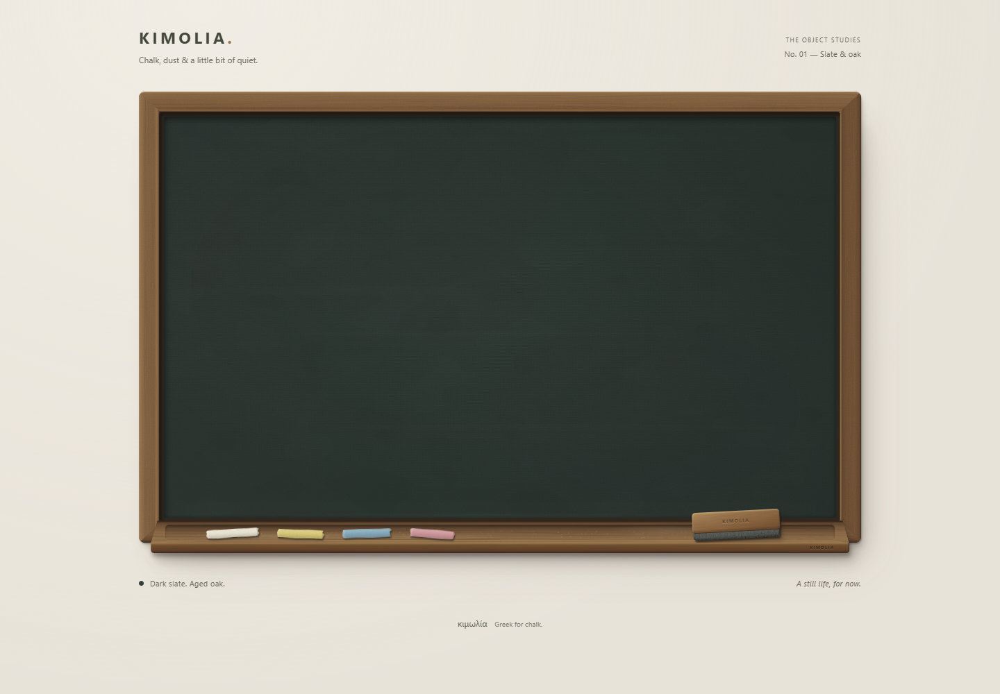

# Kimolia

A physical chalkboard for the web. Dark slate, aged oak, four pieces of chalk, and a proper wood-and-felt duster.

**K0 + K1 only:** this is a static object study. Drawing, pickup, erasing, history, persistence and export are deliberately absent.



## Run

Use Node 24 (see `.nvmrc`).

```sh
npm ci
npm run dev
```

Open the printed local URL at `/kimolia/`.

```sh
npm run lint
npm run build
npm run preview
```

`build` runs strict TypeScript checks and produces `dist/`. The only runtime dependencies are React 19 and React DOM. The lockfile records the exact versions.

## Object construction

- Four directional oak frame pieces with mitred joints, rounded outside edges, shallow bevels and a dark inner rabbet.
- A recessed slate surface with mineral variation, fine grain and restrained wiping residue. No specular sheen.
- A projecting timber ledge with a rear groove, rounded front lip, contact shadows and sparse chalk dust.
- Four matte, irregular chalk sticks; a timber duster handle over layered charcoal felt.
- A fixed above-left light source. No pointer tracking or animation.
- A 1040px maximum width and 1.6:1 desktop board; 4:3 below 520px. The tools remain separated at 320px.

The object is DOM/CSS. Five small procedural SVG material assets are generated locally by `npm run materials` and committed. They use fixed seeds, contain no external resources, and require no runtime generation. There are no stock textures, image-service assets, fonts, analytics, storage or network APIs.

`src/components/Chalkboard/` owns composition. `src/styles/` separates the page, slate, timber, chalk and felt materials. The material generator is in `scripts/generate-materials.mjs`.

The complete static object is exposed as one described image to assistive technology. Decorative tools have no focus or button semantics until their actual behavior is implemented. K2 must introduce named native buttons, selected states and 44px touch targets alongside functionality.

## CI and Pages

CI runs install, lint, strict typecheck and production build on main pushes and pull requests. The Pages workflow independently repeats those checks before deploying.

The repository is public and Pages uses **GitHub Actions** as its source. Main pushes automatically build and deploy the app; the workflow can also be run manually. No repository variable is required.

The site URL is [nickzonzh.github.io/kimolia](https://nickzonzh.github.io/kimolia/). The Vite base is `/kimolia/`, following the [Vite Pages deployment guide](https://vite.dev/guide/static-deploy#github-pages).

## Visual verification

See [the K1 review](docs/K1-review.md) for viewport coverage, screenshots, limitations and the handoff to K2.
