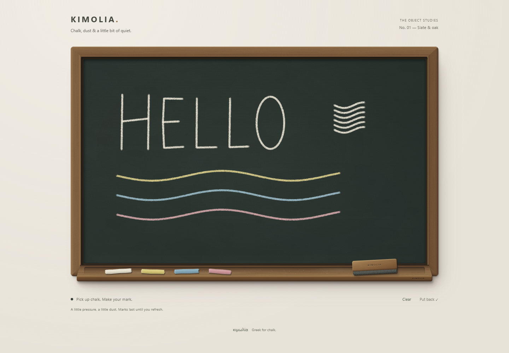

# Kimolia

A physical chalkboard for the web. Dark slate, aged oak, four pieces of chalk, and a proper wood-and-felt duster.

**K0–K3:** the physical object, tool interaction and chalk renderer. Pick up one of four pieces of chalk and draw with porous, textured strokes. Layering marks builds pigment; pen pressure gently changes width and coverage. Clear starts a fresh slate. Erasing, undo/redo, persistence and export come in later milestones.



## Run

Use Node 24 (see `.nvmrc`).

```sh
npm ci
npm run dev
```

Open the printed local URL at `/kimolia/`.

```sh
npm run lint
npm test
npm run build
npm run preview
```

`build` runs strict TypeScript checks and produces `dist/`. The only runtime dependencies are React 19 and React DOM. The lockfile records the exact versions.

## Object construction

- Four directional oak frame pieces with mitred joints, rounded outside edges, shallow bevels and a dark inner rabbet.
- A recessed slate surface with mineral variation, fine grain and restrained wiping residue. No specular sheen.
- A projecting timber ledge with a rear groove, rounded front lip, contact shadows and sparse chalk dust.
- Four matte, irregular chalk sticks; a timber duster handle over layered charcoal felt.
- A fixed above-left light source, with tighter tool shadows on contact.
- A 1040px maximum width and 1.6:1 desktop board; 4:3 below 520px. The tools remain separated at 320px.

The object is DOM/CSS, with a transparent Canvas layer for chalk. Five small procedural SVG material assets are generated locally by `npm run materials` and committed. They use fixed seeds and contain no external resources. The 48px chalk brush is generated and tinted locally at startup. There are no stock textures, image-service assets, fonts, analytics, storage or network APIs.

`src/components/Chalkboard/` owns composition. `src/styles/` separates the page, slate, timber, chalk and felt materials. The material generator is in `scripts/generate-materials.mjs`.

## Tool interaction

Click or tap a physical tool to pick it up. Its place on the rail becomes empty. Drag chalk across the slate to draw; choose another colour to switch. Choose the same tool again, press Escape, or use **Put back** to return it. The duster still demonstrates pickup and contact only; its caption explains that erasing comes next.

Keyboard: Tab to a tool and activate it with Enter or Space. Focus moves to the slate. Arrow keys move the tool; Shift takes larger steps; hold Space or Enter while moving to draw. Escape returns the tool and focus to its rail button. Clear removes all marks. Marks last for this page session only.

Each tool has a named native button with `aria-pressed`, a visible keyboard focus ring and an independent minimum 44px target. Selection changes are announced. Reduced motion and keyboard activation skip pickup travel. Touch gestures are captured only on the slate while a tool is selected; cancellation, resizing, scrolling and window focus loss cannot leave a tool stuck in contact.

`src/hooks/useToolInteraction.ts` owns selection and input lifecycles. `src/tools/toolMotion.ts` handles interruptible 160–220ms transform animations and lightweight pointer following without React renders per pointer event. Rotation pivots around the chalk tip or felt centre; contact snaps to the pointer. The duster has heavier hover inertia. Animation frames stop when settled, and all listeners/animations are cleaned up on unmount.

## Chalk rendering

`src/drawing/` owns the seeded brush, arc-length sampler, slate clipping and incremental renderer. Each stroke records colour, width, seed, input points/pressure and its original slate dimensions. The same sampler handles live input and replay; no frame-by-frame rerender or React pointer state is needed. Cached coloured brush stamps have pinholes, broken edges, slight rotation/opacity variation and sparse dust. Source-over compositing naturally builds coverage where strokes overlap.

Pointer input consumes coalesced events where available and interpolates every segment. Mouse/touch pressure is a steady 0.5; pen pressure changes density more than width. A tap produces a dot. Captured movement outside the slate splits/clips strokes rather than scribbling along the border. Resize redraws at the new resolution (DPR capped at 3); returning to the same dimensions reproduces identical pixels. Drawings scale with both dimensions of the slate, so changing between landscape and mobile proportions also changes their proportions.

Stroke records currently stay in memory. Undo/redo and persistence will build on them later; Clear releases them.

## CI and Pages

CI runs install, lint, tests, strict typecheck and production build on main pushes and pull requests. The Pages workflow independently repeats those checks before deploying.

The repository is public and Pages uses **GitHub Actions** as its source. Main pushes automatically build and deploy the app; the workflow can also be run manually. No repository variable is required.

The site URL is [nickzonzh.github.io/kimolia](https://nickzonzh.github.io/kimolia/). The Vite base is `/kimolia/`, following the [Vite Pages deployment guide](https://vite.dev/guide/static-deploy#github-pages).

## Visual verification

See [the K1 review](docs/K1-review.md) for the material baseline, [the K2 review](docs/K2-review.md) for tool interaction, and [the K3 review](docs/K3-review.md) for chalk quality, drawing checks and remaining limits.
