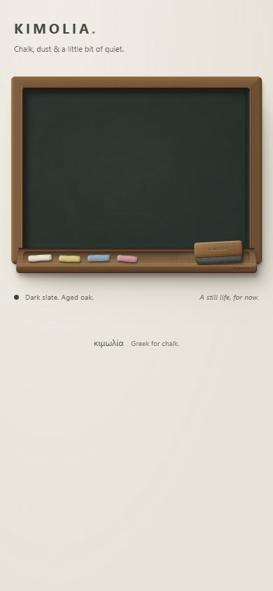

# K1 visual review — 23 September 2026

## Scope

React 19, TypeScript and Vite scaffold; CI; a prepared but gated GitHub Pages workflow; static DOM/CSS object. No drawing engine, canvas, tool selection, pointer handlers, undo/redo, persistence or export.

## Verified against the production build

| View | Viewport | Result |
| --- | --- | --- |
| Desktop | 1440 × 1000 | Full 1040px object, 1.6:1 ratio, above-left material lighting |
| Laptop | 1280 × 800 | Natural vertical page scrolling; no cropping or horizontal overflow |
| Tablet | 768 × 1024 | Landscape object, separated chalk and duster |
| Touch mobile | 390 × 844, DPR 3 | Touch emulation and reduced motion enabled; 4:3 object |
| Narrow mobile | 320 × 740 | All tools fit, no horizontal overflow |

Chromium checks confirmed no JavaScript exceptions or failed asset responses, no canvas or interactive controls, correct aspect ratios, and no tool overlap. Desktop screenshots were identical across a reload. This is browser emulation, not a physical phone or Safari verification.

## Visual assessment

The frame/slate recess, direction of oak grain and underside of the ledge establish depth. Slate stays matte; the timber has a restrained satin edge. The chalk has distinct lengths and broken ends, with soft resting shadows. The duster exposes both its wood handle and felt underside. The background is a warm neutral field without a staged classroom.

The review pass softened overly regular felt divisions, varied each chalk end, and increased small-screen caption type. There are no known blocking K1 visual defects in the checked Chromium layouts.

## Before K2

- Optional material refinement: the oak grain is still somewhat regular in close-up. A little more interrupted grain could add character without adding distress.
- Check the SVG grain and inset shadows in Safari/on a physical mobile screen before calling cross-browser visual parity complete.
- Preserve this empty-state screenshot as the reference when adding the canvas. The drawing layer must not flatten the slate or cover its recess.
- Add real tool semantics and independent minimum 44px touch targets with K2. Do not enlarge the visible chalk just to make it tappable.

## Deployment boundary

Local build and browser QA are complete. GitHub Pages is unavailable for the private repository under the current plan (the create-site endpoint returned 422). `PAGES_ENABLED` is unset so the Pages job is skipped intentionally. CI remains independent of Pages availability.
