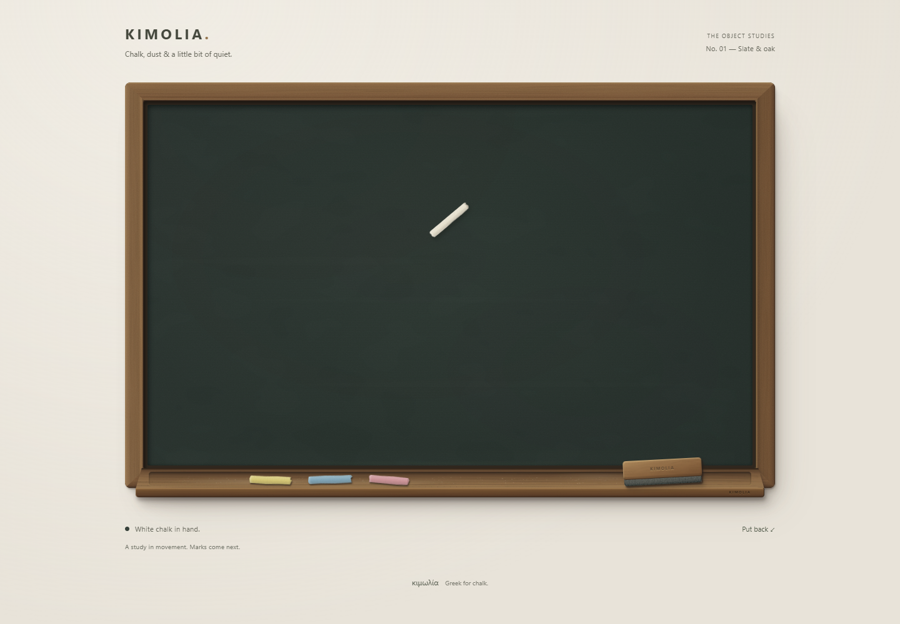
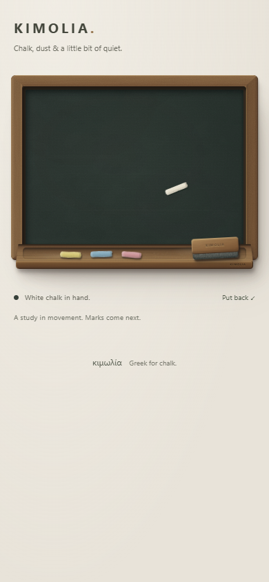

# K2 interaction review — 23 September 2026

## Delivered

- Four physical chalk buttons and the duster, with selected states and separate 44px touch targets. The active tool's original place is empty.
- Interruptible pickup and return; rapid switches return the old tool without cloning or leaving ghosts. Chalk lifts in 160ms, the duster in 180ms; returns take 190ms and 220ms respectively.
- Chalk follows lightly at roughly 48 degrees, pivoting around its left contact end. The duster follows with more weight and slight directional rotation. Pressing snaps the contact anchor to the pointer, tightens shadows and compresses the felt slightly.
- Same-tool toggle, Put back and Escape. Keyboard activation focuses the slate; arrow keys move, Shift increases the step, and Space/Enter holds contact. Escape restores focus to the selected tool's rail button.
- Pointer capture, single-pointer ownership, touch cancellation, outside release, resize/scroll recovery, window blur cleanup and reduced motion.

No canvas, chalk marks, erasing, history, persistence or export. The visible caption says that marks come next.

## Checks

Four automated geometry checks cover edge clamping, exact contact alignment, equivalent 60/120Hz hover response, heavier duster motion and eventual settling. CI and deployment both run these alongside lint, strict TypeScript and the production build.

Browser interaction checks cover:

- Mouse pickup, hover, fast contact movement, capture, outside release and returning.
- Rapid switches through all five tools; exactly one selected/held object remains after settling.
- Keyboard selection, focus transfer, arrow movement, Space contact and Escape restoration.
- Reduced-motion pickup and return with no travel animations.
- Resizing while holding a tool, and losing window focus.
- Touch pickup, drag, secondary-finger rejection, cancellation, duster selection and return.
- Separate minimum 44px targets and no horizontal overflow at 320px and 390px.

Chromium desktop and touch emulation passed without page exceptions or failed asset requests. Mobile WebKit 26.6 also passed touch selection, surface contact, keyboard control and return. A 30fps recording and sampled frames were inspected for tool/rail continuity; the K1 material layers remain unchanged. Physical phone feel is still a hands-on acceptance check.

## Next milestone

Add the deterministic chalk renderer beneath the material/tool layers. Keep stroke coordinates and tool contact anchored together, use granular brush stamps, and verify fast strokes, single taps and replay consistency before extending the duster into an eraser. The existing empty-state materials remain the reference.
