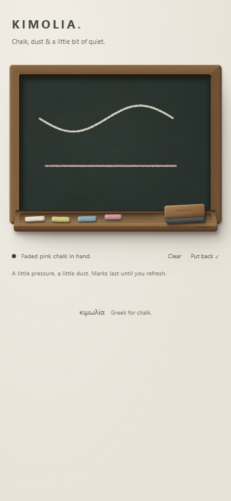

# K3 chalk review — 23 September 2026

## Delivered

Four coloured chalks now write on the slate. A seeded 48 × 48 brush provides porous coverage, broken edges and faint dust; arc-length stamping keeps fast strokes continuous. Repeated passes increase pigment coverage. Pen pressure changes density and width modestly. There is no vector `stroke()` used for the finished mark.

Contact stays under the corrected chalk tip. Taps leave dots; leaving and re-entering the slate clips and splits the mark without an edge trail. The existing mouse, touch, keyboard, tool return and reduced-motion behaviour remains in place. Clear is the only new utility.

Stroke data retains its seed, width, colour, original slate dimensions and pressure samples. Resize replays it at the current pixel density, capped at DPR 3. Drawing and animation do not update React state on every pointer movement. Returning to the same board dimensions gives identical pixels.

## Verification

- Nine automated tests: contact geometry, settling, deterministic sampling, event-packet independence, continuous fast strokes, single taps, pressure and segment clipping.
- Chromium desktop: all four colours; blank hover; tap dots; long two-point strokes with no gaps; increased coverage from overdraw; exact canvas pixel hashes after resizing away and back; edge exit/re-entry; keyboard drawing/release; duster does not yet alter marks; Clear removes everything.
- Input handling: coalesced events follow their intermediate bend; pen pressure 0.1 versus 0.9 gives visibly and numerically different coverage; secondary touch cannot draw; touch cancellation ends contact.
- Mobile Chromium at 390px and DPR 3: touch curves, colour changes, return and Clear. Mobile WebKit: touch dot, pointer curve, keyboard stroke and Clear, with no page exceptions.
- A 4,880-sample continuous drawing reproduced identical pixels after resize. On this Windows/Chromium run, synchronous 61-sample input bursts took about 1.3ms median and 6.9ms p95 (7.3ms maximum). These measure handler work on this machine, not phone frame-rate guarantees.
- Production build, strict TypeScript and lint pass. Browser checks found no failed assets or application errors. Canvas readback advice appears only while the QA script inspects pixels; the production renderer does not read back its canvas.

## Next milestone and limits

K4 is the felt duster: broad irregular wiping, faint removable ghosting and repeated-pass cleanup. Its current caption says erasing comes next. Undo/redo, autosave and export remain outside K3; marks last until refresh.

Responsive replay scales the artwork with the slate, including aspect changes. This keeps every mark visible but can change a circle's proportions between desktop and portrait mobile. Physical phone/stylus feel still needs hands-on feedback; touch and pressure here were browser-emulated.

Input API references: [coalesced pointer events](https://developer.mozilla.org/en-US/docs/Web/API/PointerEvent/getCoalescedEvents), [pointer pressure](https://developer.mozilla.org/en-US/docs/Web/API/PointerEvent/pressure).
