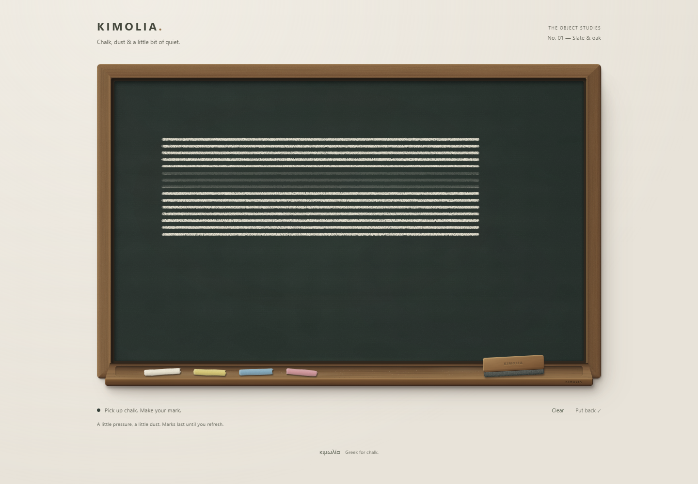
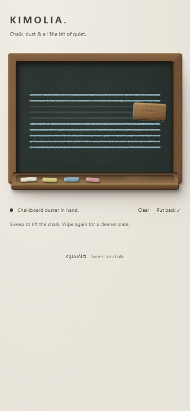

# K4 felt duster review — 23 September 2026

## Delivered

The wooden duster now erases with a broad, softly rounded felt footprint. A seeded mask leaves restrained fibre streaks and faint original-colour ghosting. It does not add haze to clean slate.

One sweep removes up to 82% of the chalk. Coverage is accumulated on a separate mask and applied against the pre-pass image, so stamp overlap does not erase the ghost accidentally. A second sweep cleans further. Direction reversal after meaningful movement starts another pass without lifting; very small jitter and stationary contact do not repeatedly erase.

Footprint dimensions follow the physical duster on desktop and mobile. Two scratch canvases are reused, coalesced samples are batched, and only the changed rectangle is composited. Chalk and eraser actions remain ordered, seeded records, ready for a later undo/redo and persistence milestone.

The long touch test also exposed a missed native compatibility click when selecting a tool immediately after repeated captured drawing gestures. Tool taps now activate on primary touch release within the button, with a 12px movement tolerance; their later compatibility click is ignored. Cancelled taps do nothing. Keyboard and mouse still use native click activation.

## Verification

- All 13 automated tests pass. New tests cover stationary duster contact, sparse/dense sweep equivalence, continuous back-and-forth cleaning, small jitter and curved direction changes.
- Chromium desktop: blank wiping and hovering unchanged; eraser contact affects only its footprint; taps erase; repeated passes clean progressively; Clear removes every remaining alpha pixel.
- Measured white-chalk coverage after a sweep: approximately 18–20% remains; after two: about 3–4%; after four: below 0.1%. The mask is seeded per gesture, so fibre details vary between sweeps.
- Resizing away and back reproduces identical per-pixel alpha coverage for mixed chalk/wipe/chalk history. Fresh chalk after a wipe is not erased during replay. Browser premultiplied-colour readback can differ by rounding; coverage comparisons use the alpha channel.
- Mobile Chromium at 390px / DPR 3: repeated touch drawing, immediate duster pickup, wiping, secondary-finger rejection, cancellation and return. No horizontal overflow at 320px. First-pass mobile residue was about 18%.
- Mobile WebKit: chalk stroke, broad wipe, touch erase and Clear, with around 18% first-pass residue and no page exceptions.
- Touch-toggle checks wait through any compatibility click to confirm exactly one activation. Keyboard after touch, mouse after touch, cancelled tool taps and reduced motion all pass.
- Lint, strict TypeScript and production build pass. No added runtime dependencies.

## Remaining work

Undo/redo, autosave and export are next. Marks still last only for this page session. As in K3, a change in the board's aspect ratio scales the artwork to match it. Physical phone and stylus feel remains a hands-on check; touch and pen tests here use browser emulation.
