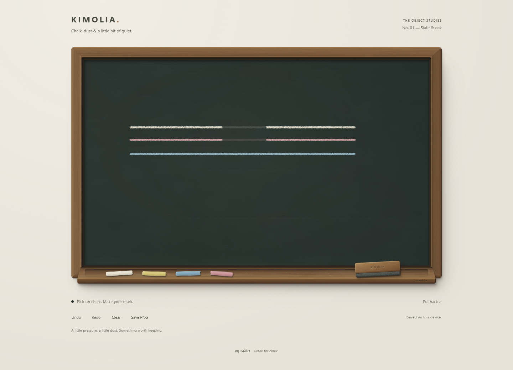
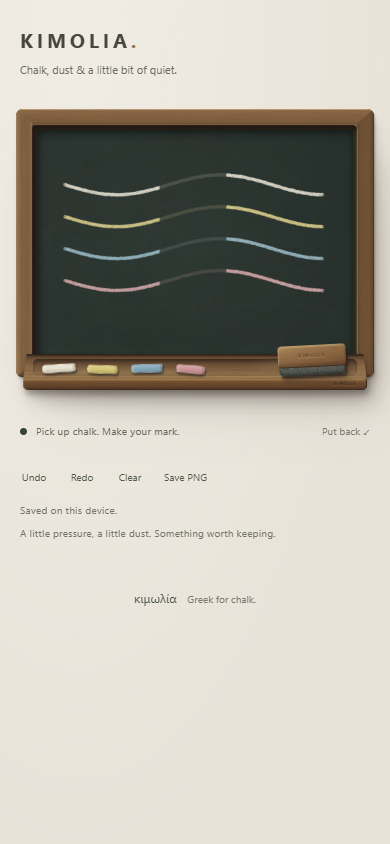
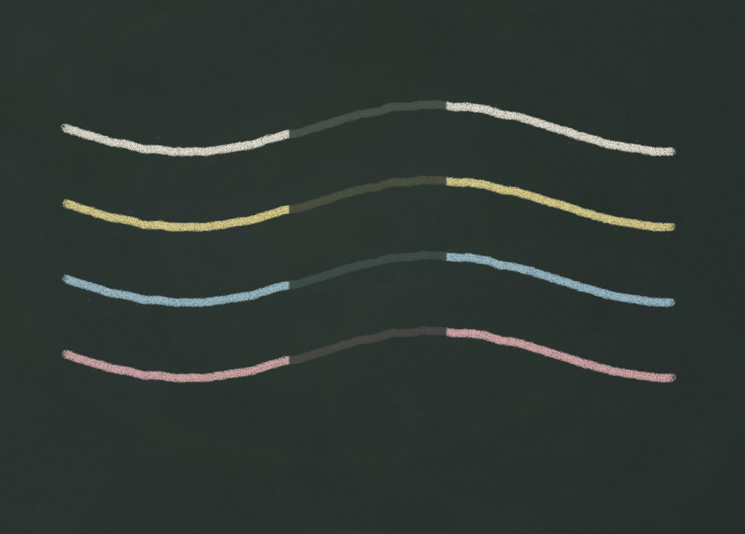

# K5 drawing utilities — 23 September 2026

## Delivered

Quiet Undo, Redo, Clear and Save PNG controls sit beneath the object. Continuous chalk and duster gestures each undo as one action, including strokes split by leaving the slate. Clear is reversible. Branching with a new mark discards redo history. Ctrl/Cmd+Z, Ctrl/Cmd+Shift+Z and Ctrl+Y work while the board or its controls have focus.

Versioned chalk/duster records autosave locally after a short pause and flush when the page is hidden or left. Refresh restores the visible drawing with the same seeded texture and ghosting. Held tools and the session undo stack reset. Storage failures are visible; malformed saved data is not overwritten on load. There is no account or server storage.

PNG export snapshots current marks and composes them over the slate tone, mineral texture and grain. It downloads as `kimolia-board.png`, at the current canvas resolution, without the frame, rail, tools or controls. Raster companions of the original slate SVGs avoid a WebKit canvas security error found during testing.

The mobile run also exposed suppressed native clicks on utility buttons immediately after a captured drawing gesture. Utility buttons now use completed touch release, with compatibility-click suppression, as the physical tool buttons already do. Native keyboard and mouse activation remain supported.

## Verification

- All 20 unit tests pass: existing sampling/geometry tests plus gesture grouping, Clear across repeated undo/redo, branching, restored base drawings, full stroke round trips, invalid records and storage failures.
- Chromium desktop: chalk, duster and Clear undo/redo reproduce per-pixel alpha coverage. Edge exit/re-entry is one action. Ctrl/Cmd shortcuts and new-branch behaviour pass.
- An immediate refresh retains the latest completed gesture, including mixed chalk/wipe/chalk history. Refresh resets tool selection and undo state; Clear also survives refresh.
- Malformed local storage is reported and left untouched. Denied reads/writes report an unavailable save while drawing and undo still work.
- Chromium mobile: real emulated touch drawing, tool taps, immediate Undo/Redo/Clear/Put back taps, refresh and resize. No horizontal overflow at 390, 320 or 280px; each utility target is at least 44 × 44px.
- Mobile WebKit: pointer drawing with touch tool/utility activation, exact alpha replay after refresh/resize, and a real PNG download. This is browser emulation, not an on-device iPhone test.
- Actual PNG files downloaded from Chromium and WebKit. Desktop PNG checked as opaque, image/png, 968 × 578, with slate variation and chalk; DPR 3 mobile exports are 948 × 680. Images visually inspected for colour, texture, ghosting and exclusion of page furniture.
- Lint, strict TypeScript and production build pass. No additional runtime dependencies.

## Practical limits / next polish

- Local saving is per browser and device; undo/redo is session-only. It is not a cloud backup. A drawing beyond the documented storage bounds stays usable in memory and can be exported, but reports that it cannot autosave.
- Changing the slate aspect ratio still stretches the artwork to the new dimensions, as in K3/K4. Export uses the current aspect ratio and resolution.
- Larger histories replay on undo/redo. Long-session profiling and any replay checkpoints belong in the next performance/polish pass.
- Physical phone/stylus feel and the phone's save/share destination remain hands-on checks.
