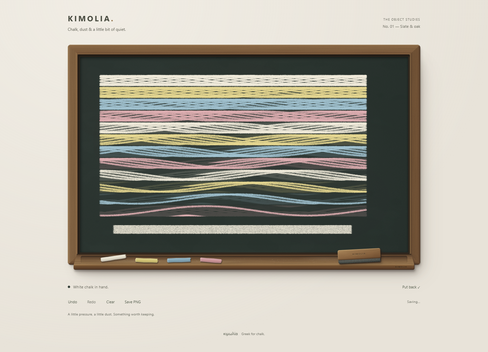

# K6 replay performance — 23 September 2026

## Change

A large drawing previously replayed every chalk and duster stroke for every Undo. A fixture of 480 mixed strokes / 24,000 points exposed a roughly one-second synchronous Undo handler at desktop DPR 2.

The renderer now caches completed raster prefixes. Periodic checkpoints are kept around 24-stroke boundaries, plus a reusable recent image. Undo/Redo restores the nearest matching prefix and replays only its remaining strokes. Prefix matching checks stroke identity and ordering, including across Clear and new branches. Stroke records remain the source for saving and restoration.

The cache holds at most four images and at most 32 MiB of nominal RGBA pixels; browser/GPU overhead, the main canvas and duster scratch buffers are separate. On a canvas large enough for only one cache image, it favours a periodic checkpoint over a newer image that Undo could not use. Oversized canvases fall back to full replay. Resize/unmount release every cached image.

The PNG texture files also use lossless grayscale-plus-alpha encoding. Their combined size drops from 736,330 to 394,181 bytes, with identical decoded RGBA pixels. They remain fetched only for export. No runtime dependency was added.

## Measurements

Local Chromium, same 480-stroke fixture, five successive new-mark / Undo / Redo cycles:

| Undo handler | Five measurements, milliseconds |
| --- | --- |
| Before, DPR 2 | 1107.7 · 1040.7 · 1064.2 · 1035.5 · 1020.3 |
| Cached, DPR 2 | 0.3 · 1.9 · 3.8 · 6.3 · 7.3 |
| Cached, DPR 3 | 0.3 · 1.2 · 2.3 · 3.2 · 4.0 |

These measure synchronous handler work, not input-to-display latency or physical-phone FPS. They are local observations, not universal performance guarantees.

Deep history remains more expensive when its prefix has been evicted. In a separate 96-stroke base plus 76 new-gesture traversal, Chromium median Undo was 2.2 ms with a 215.8 ms maximum; WebKit median was 40 ms with a 923 ms maximum. The cache bounds memory rather than retaining every past canvas.

## Verification

- All 25 unit tests pass. Five new cache tests cover prefix selection, unrelated branches, recycling, release, single-image budgets and oversized fallback.
- Chromium and WebKit each pass 152 per-pixel alpha comparisons across 76 Undos and 76 Redos, including chalk/duster overlap. Two Clear boundaries, a new branch, refresh and resize also reproduce the expected drawing.
- Pixel verification reads a separate canvas. Repeated direct reads of Chromium's drawing canvas changed its raster backend during an early test and introduced tiny edge differences; a stable software-backend run also passed all history comparisons. Production drawing does not perform these reads.
- Browser checks wait for restored state and resized canvas dimensions, avoiding comparisons during WebKit's deferred effects/resize work.
- Mobile Chromium touch drawing and WebKit touch controls pass at 390, 320 and 280px, including Clear recovery, refresh, resize and actual PNG downloads. Physical phone/stylus feel remains a hands-on check.
- Export images visually inspected; chalk colours, grain and faint wipe residue remain intact. PNG source assets additionally pass exact RGBA equality before/after compression.
- Lint, TypeScript and production build pass.

## Remaining limits

First restoration, resize and deep history beyond the retained cache still require full replay. Extreme sessions may benefit from incremental restoration or worker rendering in a future pass. Autosave limits and session-only undo history remain as documented in K5. Changing the board's aspect ratio still scales the drawing to match it.
